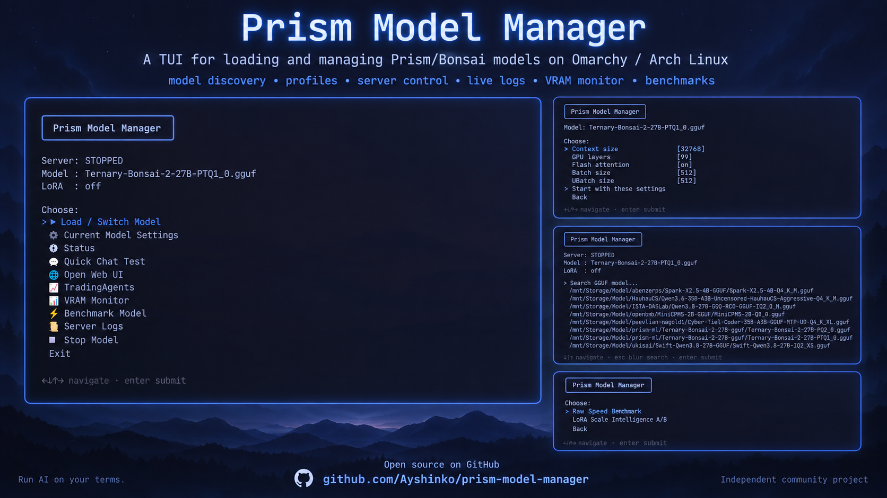

# GGUFly

> A Linux TUI for managing GGUF models and llama.cpp runtimes.

[](https://github.com/Ayshinko/ggufly/blob/main/LICENSE)
[](https://github.com/Ayshinko/ggufly/releases)
[](https://github.com/Ayshinko/ggufly)

**Run GGUF your way.**

GGUFly is a Linux terminal UI for managing GGUF quantized models through
llama.cpp-compatible runtimes. It orchestrates the complete lifecycle — model
discovery, runtime selection, server start/stop, API monitoring, chat testing,
and benchmarking — all from the terminal with a keyboard-driven interface.

**CLI:** `ggufly` • **Short alias:** `ggly` • **Deprecated alias:** `pmm`

<p align="center">
  
</p>

---

## Architecture

GGUFly operates on a simple but powerful loop:

**Model → Runtime entry → Runtime folder → llama-server → Capabilities → Inference**

### Runtime Selection

You choose the runtime explicitly. GGUFly does not guess.

- **Standard llama.cpp** — Upstream community baseline
- **PrismML / Bonsai** — Ternary quantization fork with MTP support
- **Mirai S** — Compressed-weight llama.cpp fork
- **External** — Any arbitrary llama.cpp build; a first-class citizen

There is **no "Auto" runtime mode.** Runtime behavior varies significantly
between forks and builds. GGUFly surfaces the choice and remembers your
preference per model.

### Runtime Folder

Each runtime entry points to a directory containing a `llama-server` binary.
Multiple runtimes can coexist side by side — one per fork, or several versions
of the same fork.

### Capability Detection

When you select a runtime, GGUFly parses `llama-server --help` to discover
exactly what features that binary supports: context backends (CUDA, Vulkan,
Metal, CPU), extended flags (vision, MTP, LoRA), and compile-time options.
No hardcoded flag lists.

### Codec Detection

GGUFly reads each model's GGUF metadata to determine its tensor type (codec)
and recommends a compatible runtime. The recommendation is a suggestion — you
always confirm the choice.

### Per-Model Persistence

Every model remembers its `RUNTIME_ID`, context, GPU layers, KV cache
settings, MTP configuration, and vision projector. Restore your exact setup
when you switch back.

---

## Features

- **Runtime registry** — Add, select, and manage multiple llama.cpp-compatible runtimes side by side
- **External runtime support** — Any arbitrary llama.cpp build works as a first-class citizen
- **Capability probing** — Auto-detects available flags from the actual `llama-server --help`
- **No "Auto" runtime mode** — You choose; GGUFly remembers per model
- **Model codec detection** — Reads GGUF metadata, suggests compatible runtimes
- **Built-in fork support** — Standard llama.cpp, PrismML/Bonsai, Mirai S
- **GGUF model scanning** — Discovers `.gguf` files, reads architecture and codec metadata
- **Per-model profiles** — Persist context, GPU layers, KV cache, MTP, etc.
- **Server lifecycle** — Start, stop, switch, restart, health check, live logs
- **GPU/VRAM monitoring** — NVIDIA utilization, memory, and temperature display
- **MTP speculative decoding** — Draft-model accelerated inference where supported
- **Vision/multimodal** — `--mmproj` projector support with capability check
- **LoRA adapters** — Load adapters at server start with A/B scoring
- **Chat test** — Quick prompt verification against the running server
- **API ready info** — Displays OpenAI-compatible endpoint URL
- **Benchmark** — Performance measurement against the running server
- **Process safety** — PID tracking, boot identity, port conflict detection, stale state cleanup
- **First-run migration** — Automatic non-destructive import of old PMM configuration
- **Settings validation** — Validates settings and binary capabilities before launch

---

## Quick Start

```bash
# Clone
git clone https://github.com/Ayshinko/ggufly.git
cd ggufly

# Install
./install.sh

# Launch
ggufly
```

Or use the short alias:

```bash
ggly
```

---

## Dependencies

Linux, Bash 4.4+, **gum**, **curl**, **jq**, less, Python 3.8+ (standard library
only), GNU coreutils/findutils, procps-ng. `unzip` is required for downloading
llama.cpp releases. `xdg-open` is optional for the browser UI.

**NVIDIA GPU required for CUDA inference.** Compatible NVIDIA driver needed
(R525+ for CUDA 12). Backend binaries are version-pinned and verified by SHA256
checksums. CUDA driver and runtime libraries are **not** bundled.

On Arch Linux / Omarchy:

```bash
sudo pacman -S --needed git bash gum curl jq less python coreutils findutils procps-ng util-linux xdg-utils
```

---

## Screenshots

<p align="center">
  
</p>

<p align="center">
  
</p>

<p align="center">
  
</p>

<p align="center">
  
</p>

---

## Extended vLLM Edition

The `experimental/vllm` branch provides the multi-backend legacy edition with
vLLM, HuggingFace Safetensors, and Mirai S plugin support:

- **Branch:** [`experimental/vllm`](https://github.com/Ayshinko/ggufly/tree/experimental/vllm)
- **Desktop entry:** "GGUFly — vLLM (Experimental)"

Features retained in the extended edition:
- vLLM 0.30.0 managed Python environment
- HuggingFace/Safetensors model directory support
- Mirai S plugin with managed installs
- GPU memory utilization control
- vLLM/llama.cpp dual backend

The extended edition is maintained separately on `experimental/vllm` and may
diverge from the focused official release.

---

## History

GGUFly was originally **Prism Model Manager** (`pmm`), a tool built for the
Prism infrastructure with broader multi-backend support. In 2026 the project
was renamed to **GGUFly** to reflect its focused scope: managing GGUF models
with llama.cpp-compatible runtimes.

The multi-backend legacy lives on in the
[`experimental/vllm`](https://github.com/Ayshinko/ggufly/tree/experimental/vllm)
branch.

**Independent community project. Not affiliated with, endorsed by, or maintained
by PrismML or Mirai Labs.**

---

## Version

Version **1.0.0-dev**, licensed under the [MIT License](LICENSE).

Originally developed on **Omarchy / Arch Linux.** The launcher uses standard
Linux command-line tools and does not depend on Hyprland or an Omarchy desktop
session. Other distributions may work with the dependencies above; they have
not been validated by the maintainer.